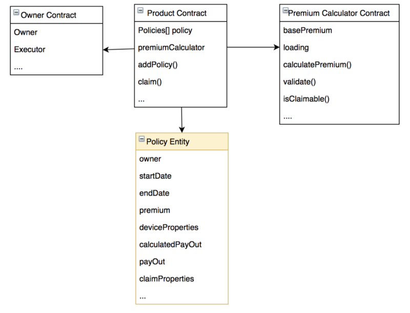
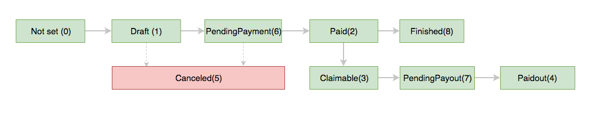

=====================
Insurance structure
=====================

Blockchain Part
^^^^^^^^^^^^^^^

The main contract will be **Product** contract which holds all insurance product properties, balance, list of policies and reference to the Premium calculator contract. 

**Policies** contain all audit-able details about policy evaluation dates, premium, payout size, device details on policy writing date and all details about the payout.

**Premium Calculator** contract will hold a risk model with calculation formulas, base premium, fees and claim validation rules.

Platform Part
^^^^^^^^^^^^^^^
Platform API:
""""""""""""""""""""""""
REST api service for other applications. Users can use to integrate with the platform. Addresses can be found at developers wiki page https://aigangnetwork.github.io/

Platform WEB:
""""""""""""""""""""""""
Aigang team maintainable web interface working on top of REST API.

Background services:
""""""""""""""""""""""""
**Aigang.Policies.Listener** service - helps to maintain policies. One of jobs example is - old draft poliecies are moved to status "Canceled" and finished to status "Finished".

**Aigang.Transactions.Listener** service - helps to maintain blockchain transactions statuses. Example: when insurance product receives new policy payment transaction this service activate policy and submit it to the Blockchain.

General policy statuses:
""""""""""""""""""""""""
* **Draft** - initial policy status.  
* **PendingPayment** - policy payment was initialized.  
* **Paid** - payment was received and policy is active.  
* **Finished** - policy is ended.  
* **Claimable** - device was broken and user can take payout.  
* **PendingPayout** - payout is initialized.  
* **Paidout** - policy is ended and payout is send.  
* **Canceled** - for some reasons policy is canceled.

