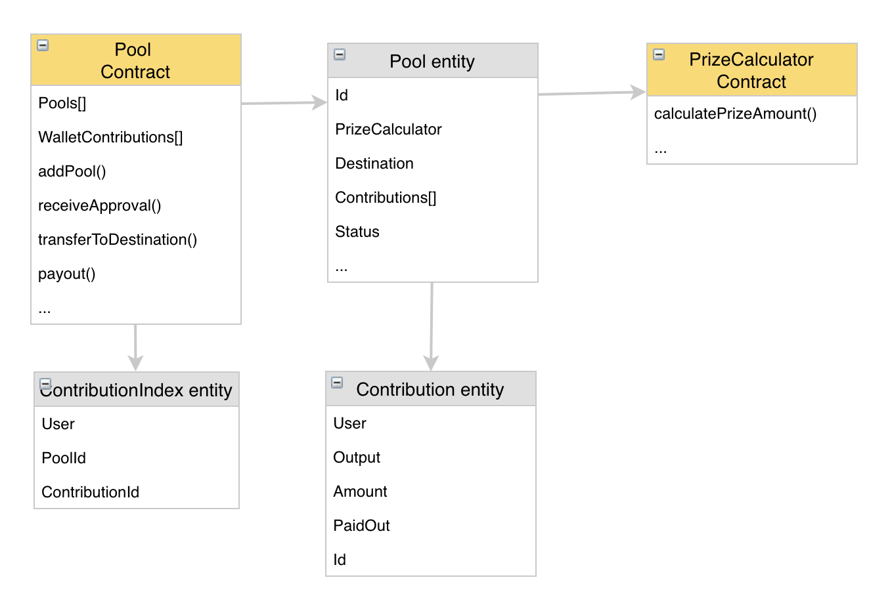
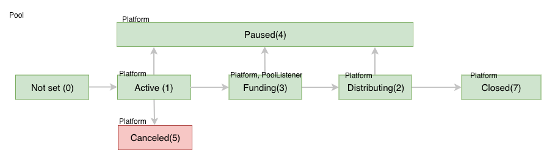
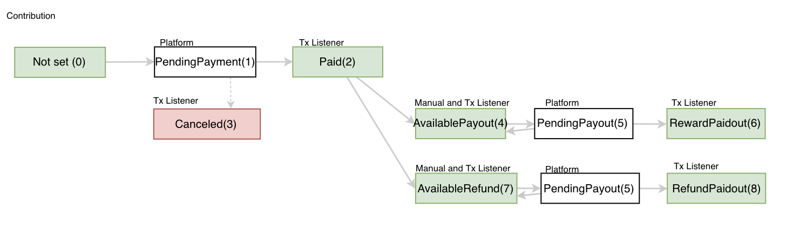

============================
Pools structure
============================

Blockchain Part
^^^^^^^^^^^^^^^^^
Full view:

Pools Contract
""""""""""""""""""""""""
The main contract will be **Pools** contract which holds:

* AIX Balance of all pools
* All actions Events 
* Available pools list
* Contributors contribution details

**Pool**

This entity holds all contributions and address to PrizeCalculator. Full Entity structure:

* id - 32 symbols hash
* contributionStartUtc - (UNIX timestamp) Start date when the pool starts to accept contributions.
* contributionEndUtc - (UNIX timestamp) End date until which the pool accept contributions.
* destination - address of the product to which this pool is dedicated.    
* status - 

  * NotSet (0)
  * Active (1) - the pool is ready for contributions. Initial status.
  * Distributing (2) - insurance product is ended and rewards are ready.
  * Funded (3) - pool contributions are ended and funds are sent to the insurance product.
  * Paused (4) - the pool is paused by administrators.
  * Canceled (5) - some issue happened and refunds for this pool contributors will happen.  
   
* amountLimit - limit how much tokens pool will collect
* amountCollected - a number of tokens were collected.
* amountDistributing - a number of tokens will be distributed as a reward.
* paidout - a number of tokens were already paid out.
* prizeCalculator - address of reward formula calculator.
* contributions - an array of contributions:
  
  * id - 32 symbols hash
  * owner - contribution owner wallet address
  * amount - contribution size in AIX tokens
  * paidout - if the pool is canceled or pool distributing - an amount which was transferred for user

**Pools functions**

* **initialize** - pools owner setup contract
* **addPool** - owner can add pool and update in case of issue
* **setPoolStatus** - owner can change pool status 
* **setPoolAmountDistributing** - owner set pool for distributing.
* **receiveApproval** - AIX token will call this function to setup contribution
* **transferToDestination** - transfer pool AIX tokens amount to destination.
* **payout** - function to take contribution rewards
* **refund** - if pool was canseled users using this function will get refund.

View functions are used, because of current solidity limitations

* **getContribution** - ability to read contribution details

Safety functions

* **withdrawETH** - withdraw all ethers in case something wrong will be found
* **withdrawTokens** - withdraw all tokens in case something wrong will be found
* **pause** - pause pools contract in case something wrong will be found

Prize calculator contract
"""""""""""""""""""""""""""
This contract stores formula how much contributor can withdraw:

Function to calculate reward amount:

* **calculatePrizeAmount** 

At first version we use simples reward distribution formula:

::

    Your contributed tokens (_contributionTokens) * _distributeTotalTokens / _collectedTotalTokens = reward

    Example:

    A pool collected 2000 tokens reserve:

    User A placed 1500 tokens
    User B placed 500 tokens

    After insurance product ended and return 2800 tokens as leftover to pool. 
    Users can now withdraw the following token amount from their contribution:

    User A -> 1500 * 2800 / 2000 = 2100 Tokens
    User B -> 500 * 2800 / 2000 = 700 Tokens
  

Platform Part
^^^^^^^^^^^^^^^
Platform API:
""""""""""""""""""""""""
REST api service for other applications. Users can use to integrate with the platform. 
Addresses can be found at developers wiki page https://aigangnetwork.github.io/

Platform WEB:
""""""""""""""""""""""""
Aigang team maintainable web interface working on top of REST API.

Background services:
""""""""""""""""""""""""
**Aigang.Transactions.Listener** service - helps to maintain blockchain transactions statuses. Example: when contribution receives payment transaction this service activate contribution and update status to "Paid".

General pool statuses in platform:
""""""""""""""""""""""""""""""""""""""""""""""""""
* **Active (1)** - pool is ready to accept contributions. Initial status.
* **Distributing (2)** - the pool is distributing rewards.
* **Funding (3)** - Contributing is ended and collected pool will be sent to destination.
* **Paused (4)** - contribution in this pool is paused and administrators are investigating what is happening
* **Canceled (5)** - some issue happened and refunds for this pool contributors will happen. 
*  **Closed (7)** - final state when all rewards are taken.

General contribution statuses in platform:
""""""""""""""""""""""""""""""""""""""""""""  
* **PendingPayment (1)** - contribution payment was initialized.  
* **Paid (2)** - contribution was received.  
* **Canceled (3)** - contribution is canceled because paiment was not received in 24 hours.  
* **AvailablePayout (4)** - reward is available to you to take out.     
* **AvailableRefund (7)** - pool is canceled and you can refund your tokens.  
* **RewardPaidout (6)** - reward was successful and tokens was sent to a user. 
* **PendingPayout (5)** - payout transactions were submited and the platform is waiting until it will be commited.  
* **RefundPaidout (8)** - refund was successful and tokens was sent to a user. 

